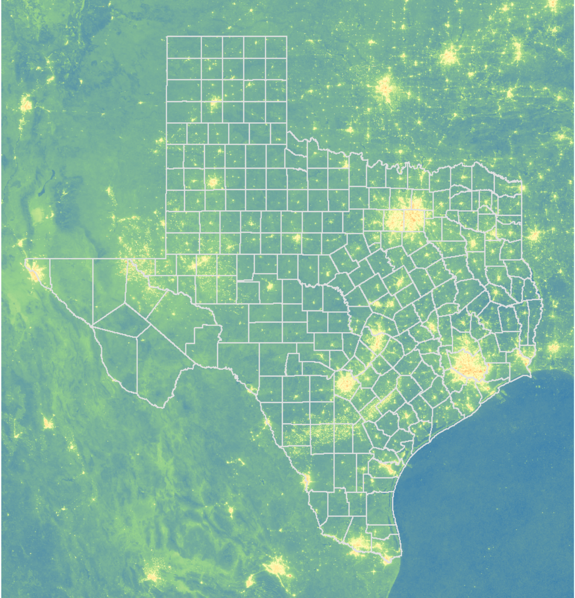

# geoALAN Dashboard

## Introduction

**This is a R Shiny app to investigate artificial light at night (ALAN) geographic variation and its association with chronic diseases.**               
*ALAN* has gained substantial interest recently. Many studies have shown the excessive exposure to ALAN can lead to various adverse health outcomes including cancer,  diabetes and other chronic diseases.  

 

## Dataset

**1. ALAN Data**

**2. PLACES Data**

## Features
